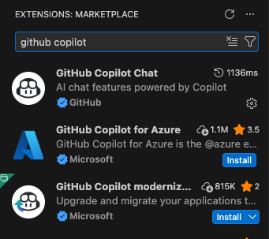
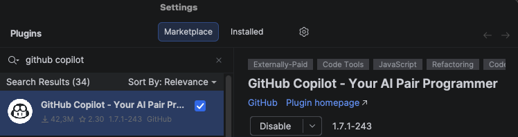
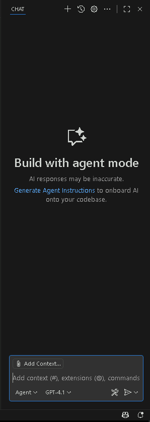
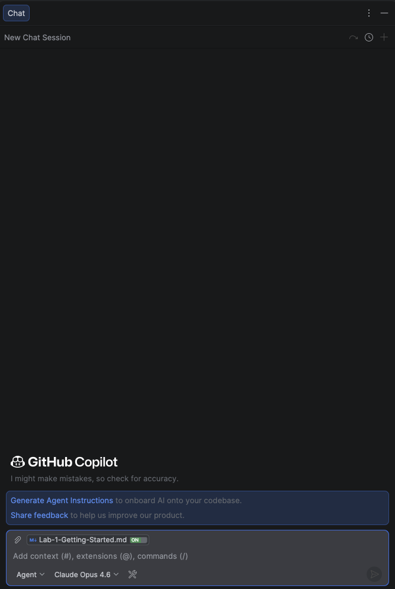

# Lab 1 - Lab Overview and Setup

#### Duration: 15 minutes

## Overall Lab Objectives

This 4-hour hands-on lab is designed to give developers practical experience using **GitHub Copilot** as an AI-powered assistant throughout the Software Development Life Cycle (SDLC). You will explore how GitHub Copilot can improve developer productivity, code quality, and security—from feature planning and prototyping to implementation, code review, and remediation.

Through a series of guided, real-world exercises, you will learn how to:

- Understand GitHub Copilot’s role across all phases of the SDLC
- Plan new features and define success criteria with GitHub Copilot
- Use AI-powered code completions directly within the IDE
- Leverage GitHub Copilot Chat in Ask and Agent modes
- Delegate tasks to the GitHub Copilot coding agent to multiply development impact
- Review code at scale using GitHub Copilot code reviews
- Detect and fix security vulnerabilities using GitHub Copilot Autofix
- Optimize GitHub Copilot performance using Custom Instructions and Prompt Files

## Welcome to The Daily Harvest

🍎 **Your Mission: Develop your daily pick of fresh code!**

You’ve joined **The Daily Harvest**, a startup building a backend API for fruit e-commerce platforms.

### Your Role

As a new developer, you’ll extend API functionality, improve tests, and use **GitHub Copilot** to work faster while keeping quality high.

### The Challenge Ahead

In this lab, you’ll focus on:

- Understanding and navigating the existing codebase effectively
- Enhancing test coverage across critical API components
- Planning and implementing a robust shopping cart API for the e-commerce platform
- Maintaining high code quality standards across the development team
- Identifying and resolving security vulnerabilities

Speed matters, but quality and security are non-negotiable. You’ll use GitHub Copilot to balance both.

Let’s get started! 🍊

## Setting Up Your Environment

### Prerequisites

### GitHub Copilot Business License from Omegapoint

To get this you need to go to this link and join the group [Github Copilot Business License](https://myaccount.microsoft.com/groups/ad8903a5-9a02-4d36-b906-afa5ee8b283b
).

Make sure that you sign in with your Github Enterprise account in your IDE when setting up Copilot.

### API client

Several labs require calling REST endpoints while the API is running.

Use any API client you prefer.

Examples:

- Bruno
- Postman

If you do not want to install a GUI client, `curl` is fully sufficient for the lab tasks.

## Creating your Repository

1. Navigate to the **copilot-lab** repository in a web browser.

   ```
   https://github.com/Omegapoint/copilot-lab
   ```

1. Use the template to create your own repository

   

1. After a few moments you should be taken to the home page of your newly-created repository.

## Setting up IDE

1. Open your repository in an IDE that supports GitHub Copilot (VSCode, IntelliJ etc.)

2. Click on the **Extensions** in VSCode, and **Plugins** then **Marketplace** in JetBrains products, search for **GitHub Copilot**. Install the extension **GitHub Copilot** (which includes Chat functionality).

**VsCode**:

   

**JetBrains**:
   

3. Verify that the Copilot chat window appears in the IDE.

**VSCode**: You should see a Copilot icon in the sidebar. Click it to open the chat.

   

**JetBrains**: You should see a Copilot icon in the bottom right corner. Click it to open the chat.
   
