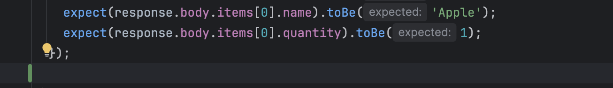

# Lab 3 - Writing Unit Tests with GitHub Copilot

#### Duration: 30 minutes

## 🎯 Learning Objectives

By the end of this exercise, you will:

- Understand how to use GitHub Copilot's Autocomplete feature and Agent mode for code modifications
- Learn to write comprehensive unit tests with AI assistance
- Improve existing code coverage using intelligent test generation
- Understand best practices for AI-assisted testing

## 🍎 Scenario: Improving The Daily Harvest's Test Coverage

Some critical API endpoints currently lack test coverage. The team identified the cart routes module as a priority before the next release.

Your task is to use GitHub Copilot to write high-quality unit tests that:

- Verify happy path scenarios such as the cart having items
- Test edge cases like the cart being empty
- Improve overall code quality and reliability

## 📊 Step 1: Baseline Testing and Coverage Analysis

Before writing new tests, establish a baseline by running the current suite and coverage report.

### Instructions:

1. Navigate to the project directory in your terminal
   ```bash
   cd application
   ```
2. Run the existing test suite to ensure everything is working:
   ```bash
   npm test
   ```
3. Generate a coverage report to see which parts of the code need additional testing:
   ```bash
   npm run test:coverage
   ```
4. Review the coverage report and note:
   - Overall coverage percentage
   - Which files have low coverage
   - Specific lines or functions that aren't tested

### 💡 What to Look For:

- **Statements**: Percentage of code statements executed during tests
- **Branches**: Percentage of conditional branches tested
- **Functions**: Percentage of functions called during tests
- **Lines**: Percentage of executable lines covered

This baseline shows where new tests are needed.

**Pro Tip:** Keep the coverage report open in a separate terminal tab so you can re-run it after each change.

## ✏️ Step 2: Using Autocomplete to Generate One Additional Unit Test

Start by generating one additional unit test using GitHub Copilot Autocomplete.

### Instructions:

1. Open the existing test file named `cart.test.ts` in the `src/__tests__/routes` directory.
1. Place your cursor underneath the existing test and go to a new line.

   

1. Add a comment (starting with '//') stating that you'd like to test the condition where the cart displays an "empty cart message" when it is empty.
   Please refer to the below sample comment if you get stuck.

   <details>
   <summary>Sample New Test Comment</summary>

   ```
   // Verify that the cart API returns an empty items array when the cart is empty.
   ```

   </details>

1. After adding the comment, press `Enter`. GitHub Copilot will suggest code; press `Tab` to accept suggestions. If it starts generating another test, press `Esc` to stop.

1. Once the test is generated, try running it to make sure that it and the existing test pass. If there are any failures, try asking GitHub Copilot how to fix them.

## 💭 Step 3: Using Agent Mode to Generate Additional Unit Tests

The cart route has more scenarios to cover. Instead of continuing with Autocomplete, use Agent mode to generate tests faster.

### Why Agent Mode is Perfect for Unit Testing:

- 🎯 **Context-aware**: Understands existing code and test patterns
- 🔧 **Targeted edits**: Can create and update files directly
- 📋 **Consistent style**: Follows project conventions
- 🚀 **Faster coverage**: Generates broader test suites quickly

### 🔍 Providing Context for Better Test Generation:

GitHub Copilot gathers context from:

- **Active editor**: The currently open file and your cursor position
- **Selection**: Any highlighted/selected code in the editor
- **Open tabs**: Files you have open in IDE tabs
- **Workspace**: Your project structure and related files

For better test generation, explicitly provide context for the route handler under test.

#### 📋 Best Practices for Test Context:

1. **Open the source file**: Keep `routes/cart.ts` open next to the test file
2. **Use file references**: Drag and drop a file into the chat input, or type the filename and select it from the suggestion list, to attach it as context
3. **Highlight relevant code**: Select route handlers or functions you want covered
4. **Reference dependencies**: Attach files like `utils/helpers.ts` or `routes/products.ts` as context when needed

**Learn More:** [VS Code Copilot Chat Context Documentation](https://code.visualstudio.com/docs/copilot/chat/copilot-chat-context)

### Instructions:

1. Open GitHub Copilot Chat and switch to **Agent mode**
2. Include `routes/cart.ts` in your context by opening it in a tab or attaching it as context (drag and drop into the chat input, or type the filename and select it from the suggestion list)
3. Write prompts to generate tests for uncovered conditions in the cart route.

<details>
  <summary>Sample Test Generation Prompt</summary>

```
Generate comprehensive tests for the cart route handler. Make sure to generate tests that cover negative scenarios and edge cases.
```

</details>

<details>
  <summary>More Specific Prompt</summary>

```
Add tests that cover the following conditions if they have not already been covered:
 - POST /api/cart returns 400 when productId is missing
 - POST /api/cart/checkout returns 400 when the cart is empty
 - DELETE /api/cart/:id returns 404 when the item is not in the cart
```

</details>

4. **Important**: Always review AI-generated tests. Make sure to:
   - Check for correctness and completeness
   - Ensure adherence to your project's coding standards
   - Validate that all edge cases are covered

5. Run the generated tests and verify behavior. If tests fail, ask GitHub Copilot for help fixing them.

### 🎁 Optional Task: Refine tests to handle an edge case that GitHub Copilot didn't cover initially

**Pro Tip:** More specific prompts usually produce better tests. Review and iterate until quality is acceptable.

## 🎓 Step 4: Best Practices and Code Review

Now review your tests to ensure quality and maintainability.

### Why Code Review Matters for AI-Generated Tests:

- 🔍 **Quality assurance**
- 📏 **Standards compliance**
- 🎯 **Coverage validation**
- 🛠️ **Maintainability**

### Instructions:

Ask GitHub Copilot to review your unit tests and make suggestions for improvement. Consider implementing its suggestions if you have time.

```
Do these tests follow testing best practices? Check the following and suggest improvements if needed.
- Clear and descriptive test names
- Single responsibility per test
- Clear arrange-act-assert structure
- Single assertion per test (when appropriate)
- Appropriate use of mocks/stubs
- Good error messages
- Good test data setup
- Proper error handling
- Performance considerations
- Maintainable test structure
```

## 🏆 Exercise Wrap-up

You've successfully used GitHub Copilot's Agent mode to:

- ✅ Generate comprehensive unit tests for critical business logic
- ✅ Cover edge cases and error conditions
- ✅ Improve code coverage and quality
- ✅ Follow testing best practices

### Reflection Questions:

1. **How did Agent mode compare to Autocomplete for test generation?**
2. **What types of test scenarios did GitHub Copilot excel at generating?**
3. **Where did you need to provide additional guidance or corrections?**
4. **How might you use Agent mode differently in future testing tasks?**

### Key Takeaways:

- GitHub Copilot's Agent mode is a powerful tool for generating and refining unit tests
- Always review AI-generated code to ensure quality and correctness
- Providing relevant context (open files, file references) significantly improves output quality
- More specific prompts produce better, more targeted tests
- Iterating on prompts and reviewing results is key to achieving high test quality

## 🚀 Next Steps

In Lab 4, you'll use GitHub Copilot **Agent mode** for more complex, multi-file tasks.
